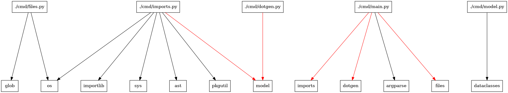

# python-graphviz-dependency


Generates dependency graph. Red lines are non stdlib dependencies.



## Run

Requires graphviz installed

```bash
python cmd/main.py > graph.dot
dot -Tpng graph.dot -o graph.png
```
